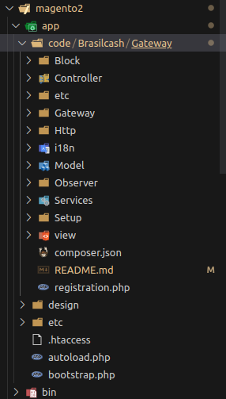
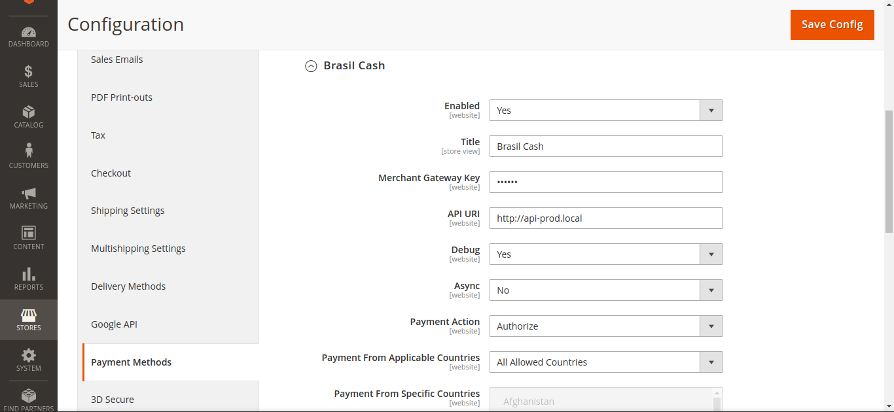

# Instalação

> Atenção: é necessário estar utilizando PHP 8 para rodar o projeto.

O primeiro passo para instalação do projeto é a instalação do Magento. O passo a passo pode ser encontrado [aqui](https://experienceleague.adobe.com/docs/commerce-operations/installation-guide/composer.html#get-the-metapackage).

Caso o instalador peça as credenciais, utilize a chave pública e privada criadas dentro do [site do Magento](https://repo.magento.com/).

Para a instalação e execução do Magento é necessário uma instância [OpenSearch](https://opensearch.org/downloads.html) rodando.

Após a instalação realizada, clone o projeto dentro da pasta app/code/Brasilcash/Gateway. É necessário respeitar essa estrutura para que o módulo seja reconhecido. O módulo é definido em `app/code/Brasilcash/Gateway/etc/module.xml`. A estrutura de pastas deve ficar como abaixo:

Após a estrutura montada, a instalação do módulo é feita executando o comando `php bin/magento setup:upgrade` na raiz do Magento.

# Rodando o Projeto

Na raiz do Magento utilize o comando `php -S 127.0.0.1:8082 -t pub/ phpserver/router.php` para rodar o Magento com o built-in php server. Dessa forma é possível utilizar outra versão do PHP que não esteja no Apache, e também utilizar uma porta específica para mapeamento com [Ngrok](https://ngrok.com/) (necessário para o webhook).

O módulo é configurável acessando o painel admin do Magento em `Stores > Configuration > Sales > Payment Methods`:

## Adicionando novas configurações

Novas entradas na configuração podem ser adicionadas no arquivo `app/code/Brasilcash/Gateway/etc/config.xml` e `app/code/Brasilcash/Gateway/etc/adminhtml/system.xml`. O primeiro arquivo diz respeito à configuração do módulo, e a segunda à possibilidade de editar dentro do painel.

# Fluxo de pagamento

## Tela de pagamento

O fluxo de pagamento é gerenciado pelos seguintes arquivos:

- `app/code/Brasilcash/Gateway/Model/Ui/ConfigProvider.php`
- `app/code/Brasilcash/Gateway/view/frontend/web/js/view/payment/method-renderer/brasilcashPaymentGateway.js`
- `app/code/Brasilcash/Gateway/view/frontend/web/template/payment/form.html`
- `app/code/Brasilcash/Gateway/Observer/DataAssignObserver.php`

O primeiro é responsável por fornecer informações do back-end ao front-end.

O segundo é responsável pelo front-end e por enviar os dados ao back-end no submit do pagamento.

O terceiro é o layout do método de pagamento. O layout utiliza [KnockoutJS](https://knockoutjs.com/).

A função getData é responsável por enviar as variáveis ao back-end. As mesmas variáveis configuradas nesse arquivo devem ser configuradas no `DataAssignObserver.php`, caso contrário não ficarão disponíveis no back-end.

## Requisições

Os arquivos responsáveis pelas requisições de autorização, captura e reembolso são definidos no arquivo `app/code/Brasilcash/Gateway/etc/di.xml` em `BrasilcashPaymentGatewayCommandPool`. Importante ler a [documentação do método de pagamento](https://developer.adobe.com/commerce/php/development/payments-integrations/base-integration/) para entender o fluxo de chamada nos arquivos. O vídeo [Magento 2 | Payment Gateway | Custom Module | Command Pool | Transfer Factory
](https://youtu.be/TAuphX07qAs) foi utilizado para desenvolver essa parte do módulo, sendo um material interessante para entendê-lo.

Levando a requisição de autorização como exemplo, a primeira chamada ocorre no arquivo `app/code/Brasilcash/Gateway/Gateway/Request/AuthorizationRequest.php` que monta o corpo da request. 

A resposta da API  será tratado por `app/code/Brasilcash/Gateway/Gateway/Response/TxnIdHandler.php`, responsável por adicionar o ID da transação e demais campos, como o PIX, no pedido.

A validação da request ocorre em `app/code/Brasilcash/Gateway/Gateway/Validator/ResponseCodeValidator.php`, responsável por identificar erros na API.

Atualizações do status do pedido são realizados na rota de webhook `app/code/Brasilcash/Gateway/Controller/Transactions/Webhook.php`, que é registrada em `app/code/Brasilcash/Gateway/Controller/Router.php`.

> A atualização do status ocorre apenas no webhook, mesmo que as requests sejam feitas de modo síncrono. Caso o webhook não esteja configurado no dashboard Brasilcash, os pedidos não serão atualizados. A única diferença relevante no modo sync é que pagamentos recusados retornam erro para o cliente no momento do checkout.